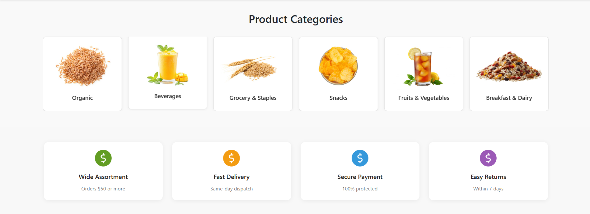

# MegaMartX 🚀


MegaMartX ek modern E-commerce web application hai jisme users products dekh sakte hain, shopping cart manage kar sakte hain, aur secure checkout kar sakte hain. Ye project React + Vite par bana hai aur scalable architecture follow karta hai.

## Table of Contents

- [Features](#features)
- [Tech Stack](#tech-stack)
- [Installation](#installation)
- [Usage](#usage)
- [Screenshots](#screenshots)
- [Contributing](#contributing)
- [License](#license)
- [Contact](#contact)

## Features

- 🛒 Product Listing and Details
- 🔍 Search and Filter
- 🛍️ Shopping Cart & Wishlist
- 👤 User Authentication (SignUp, Login, Logout)
- 💳 Secure Checkout & Payment Integration
- 📦 Order History & Tracking
- ⭐ Product Reviews & Ratings
- 📱 Fully Responsive (Mobile Friendly)
- ⚡ Fast Performance (Vite powered)
- 🌐 Social Media Share Options

## Tech Stack

- **Frontend:** React, Vite, Redux Toolkit, Tailwind CSS
- **Backend:** Node.js, Express <!-- Optional, agar use ho raha hai -->
- **Database:** MongoDB <!-- Optional, agar use ho raha hai -->
- **Other:** JWT Auth, REST API, ESLint

## Installation

```bash
git clone https://github.com/harshkushwah-dev/MegaMartX.git
cd MegaMartX
npm install
npm run dev
```

## Usage

- Visit `http://localhost:5173` in your browser.
- Register/Login to explore features.
- Add products to cart, wishlist, and checkout.

## Screenshots

<!-- Apne screenshots waqai /screenshots folder me dal dein -->



## Environment Variables

Agar app me koi environment variable ka use ho raha ho toh:

```
VITE_API_URL=your_api_url
VITE_FIREBASE_KEY=your_firebase_key
```

## Contributing

Aapka swagat hai! Issues banayein, pull requests bhejein, ya documentation update karein.

1. Fork this repo
2. Create a new branch (`git checkout -b feature-name`)
3. Commit changes (`git commit -m 'Add new feature'`)
4. Push to branch (`git push origin feature-name`)
5. Open a Pull Request

## License

This project is licensed under the [MIT License](LICENSE).

## Contact

- **Developer:** [Harsh Kushwah](https://github.com/harshkushwah-dev)
- **Email:** harshkushwah.dev@gmail.com

---

Agar aur customization chahiye ya koi section add/remove karna ho toh bata sakte hain!
[Live Demo](https://megamartx.vercel.app) | [Issues](https://github.com/harshkushwah-dev/MegaMartX/issues)